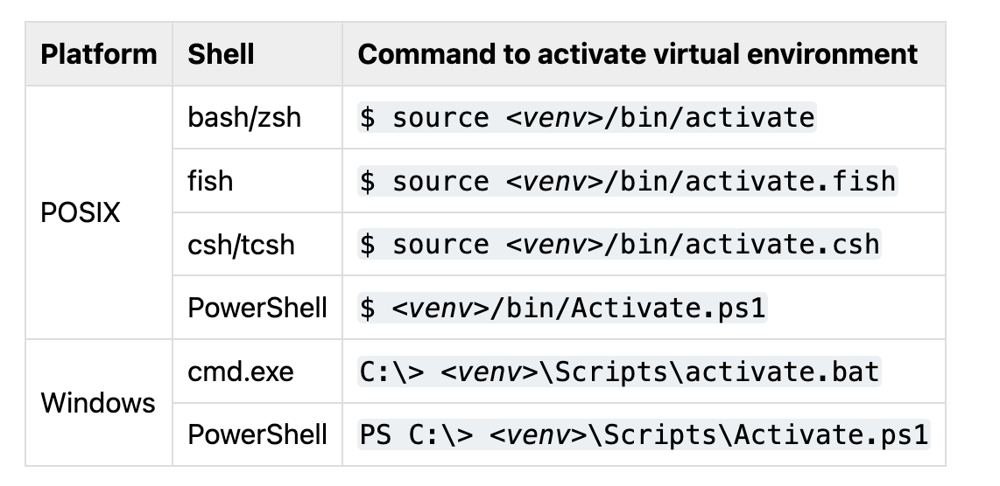
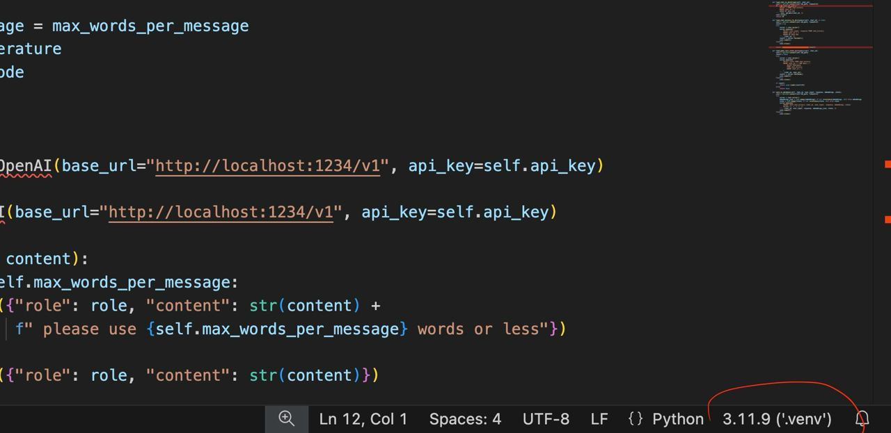
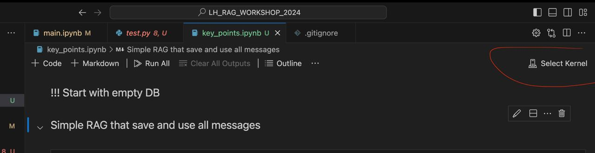

# LH_RAG_WORKSHOP_2024

### Setup the project 
 
#### Short version

To initialize the project:

 1. Install python3.11 in you don't have python3+ intalled
 2. Run `git clone`
 3. Run `./setup.sh`
 4. Place the API key in the .env file
 5. Open the project in the course folder

 #### Detailed version

 **IF YOU HAD ANY PROBLEMS BEFORE, please <u>delete</u> local version of this repo and follow this instruction.**

 1. Make sure you have python3+ installed. To check it run `python --version` in your console/terminal.
 If it's not installed download and install python3.11 from [here](https://www.python.org/downloads/).
 2. Clone this repo to your local directory.
 3. Open this directory (you should be inside the folder 'LH_RAG_WORKSHOP_2024') in terminal/console.
 4. Run `python -m venv .venv` to create virtual enviroment.
 5. Activate virtual enviroment using one of the following commands (instead of '\<venv\>' put '.venv', for example: `source .venv/bin/activate`)
 
 6. Make sure it was activated. Your console/terminal should look like this: `(venv) C:\Users\acer\Desktop>`
 7. Now run `pip install -r requirements.txt` to install all needed requirements to this virtual enviroment.
 8. It's mostly done but there are two moments you'll need to check. 
 If you are using VSCode open any python file ('.py') and click in the bottom-right corner on the python version and then select your virtual enviroment (venv) 
 Than open any jupiter notebook ('.ipynb') and in the top-right corner select your virtual enviroment (venv) as a kernel 